# Hi, I'm Ruslan 👋

I build backend systems, APIs, and automation tools with a focus on clean architecture and reliable delivery.

## What I'm Focused On

- 🔭 Building scalable backend services and practical developer tools
- 🤖 Exploring AI integrations, MCP servers, and workflow automation
- 🧩 Designing maintainable APIs and service-oriented systems
- 🌱 Improving system design, observability, and DevOps practices

## Featured Projects

<table>
  <tr>
    <td width="50%" valign="top">
      <h3><a href="https://github.com/Ieruss/sdukomekshi">SDU Komekshi</a></h3>
      
An asynchronous Telegram assistant with permissions, scheduling, parsing, background jobs, and persistent state.

      
<code>Python</code> <code>Aiogram</code> <code>PostgreSQL</code> <code>Redis</code>

    </td>
    <td width="50%" valign="top">
      <h3><a href="https://github.com/Ieruss/football_time">Football Time</a></h3>
      
A football field booking system with time-slot management, an admin interface, and conflict-safe reservations.

      
<code>FastAPI</code> <code>SQLite</code> <code>Jinja2</code>

    </td>
  </tr>
</table>

> More backend and AI projects are currently being developed in private repositories.

## Tech Stack

  

### AI-Assisted Engineering

  
  
  

I use Claude Code and OpenAI Codex as engineering tools for repository analysis, implementation, debugging, code review, testing, and workflow automation. I also work with MCP integrations and agent-guided development workflows.

## GitHub Activity

  <picture>
    <source media="(prefers-color-scheme: dark)" srcset="https://github-readme-stats.vercel.app/api?username=Ieruss&show_icons=true&hide_border=true&rank_icon=github&theme=github_dark" />
    <source media="(prefers-color-scheme: light)" srcset="https://github-readme-stats.vercel.app/api?username=Ieruss&show_icons=true&hide_border=true&rank_icon=github&theme=default" />
    
  </picture>
  <picture>
    <source media="(prefers-color-scheme: dark)" srcset="https://github-readme-stats.vercel.app/api/top-langs/?username=Ieruss&layout=compact&hide_border=true&theme=github_dark" />
    <source media="(prefers-color-scheme: light)" srcset="https://github-readme-stats.vercel.app/api/top-langs/?username=Ieruss&layout=compact&hide_border=true&theme=default" />
    
  </picture>

## Contribution Snake

  <picture>
    <source media="(prefers-color-scheme: dark)" srcset="https://raw.githubusercontent.com/Ieruss/Ieruss/output/github-snake-dark.svg" />
    <source media="(prefers-color-scheme: light)" srcset="https://raw.githubusercontent.com/Ieruss/Ieruss/output/github-snake.svg" />
    
  </picture>

## Let's Connect

  
  

